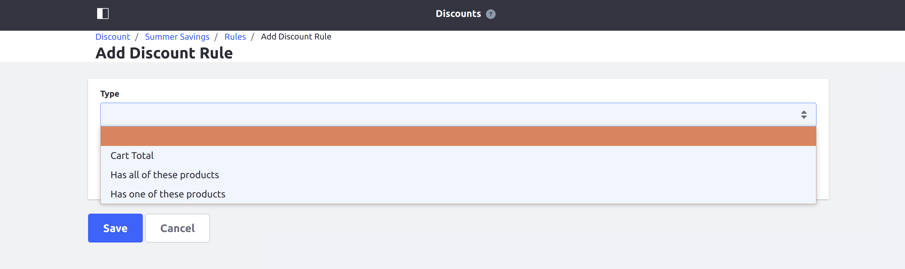
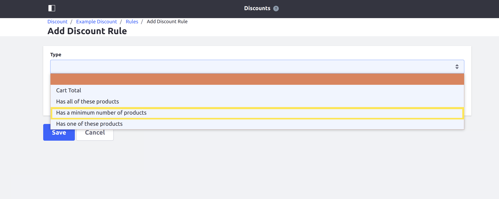

# Adding a New Discount Rule Type

This tutorial will show you how to add a new discount rule type by implementing two interfaces: [CommerceDiscountRuleType](https://github.com/liferay/com-liferay-commerce/blob/2.0.5/commerce-discount-api/src/main/java/com/liferay/commerce/discount/rule/type/CommerceDiscountRuleType.java) and [CommerceDiscountRuleTypeJSPContributor](https://github.com/liferay/com-liferay-commerce/blob/2.0.5/commerce-discount-api/src/main/java/com/liferay/commerce/discount/rule/type/CommerceDiscountRuleTypeJSPContributor.java).

Discount rule types define conditions for evaluating when discounts will be applied to an order. Liferay Commerce provides three discount rule types out-of-the-box: [AddedAllCommerceDiscountRuleTypeImpl](https://github.com/liferay/com-liferay-commerce/blob/2.0.5/commerce-discount-rule-added-all/src/main/java/com/liferay/commerce/discount/rule/added/all/internal/AddedAllCommerceDiscountRuleTypeImpl.java), [AddedAnyCommerceDiscountRuleTypeImpl](https://github.com/liferay/com-liferay-commerce/blob/2.0.5/commerce-discount-rule-added-any/src/main/java/com/liferay/commerce/discount/rule/added/any/internal/AddedAnyCommerceDiscountRuleTypeImpl.java), and [CartTotalCommerceDiscountRuleTypeImpl](https://github.com/liferay/com-liferay-commerce/blob/2.0.5/commerce-discount-rule-cart-total/src/main/java/com/liferay/commerce/discount/rule/cart/total/internal/CartTotalCommerceDiscountRuleTypeImpl.java).



## Overview

1. [**Deploy an Example**](#deploy-an-example)
1. [**Walk Through the Example**](#walk-through-the-example)
1. [**Additional Information**](#additional-information)

## Deploy an Example

In this section, we will get an example discount rule type up and running on your instance of Liferay Commerce. Follow these steps:

1. Start Liferay Commerce.

    ```bash
    docker run -it -p 8080:8080 liferay/commerce:2.0.5
    ```

1. Download and unzip [Acme Commerce Discount Rule Type]().

    ```bash
    curl liferay-m6a8.zip
    ```

    ```bash
    unzip liferay-m6a8.zip
    ```

1. Go to `liferay-m6a8`.

    ```bash
    cd liferay-m6a8
    ```

1. Build and deploy the example.

    ```bash
    ./gradlew deploy -Ddeploy.docker.container.id=$(docker ps -lq)
    ```

    >**Note:** This command is the same as copying the deployed jars to /opt/liferay/osgi/modules on the Docker container.

1. Confirm the deployment in the Liferay Docker container console.

    ```bash
    STARTED com.acme.m6a8.web_1.0.0
    ```

1. Verify that the example discount rule type was added. Open your browser to `https://localhost:8080` and navigate to _Control Panel_ → _Commerce_ → _Discounts_. Click _Edit_ within the menu for any discount, then navigate to _Rules_ at the top of the screen.

    From there, click the (+) icon to add a new discount rule. The new discount rule type ("Has a minimum number of products") will be present under the _Type_ dropdown.



Congratulations, you've successfully built and deployed a new discount rule type that implements `CommerceDiscountRuleType`.

Next, let's dive deeper to learn more.

## Walk Through the Example

In this section, we will review the example we deployed. We will create two classes: a discount rule type class and a JSP contributor for a custom UI input. Walk through the following:

* [Annotate the Discount Rule Type Class for OSGi Registration](#annotate-the-discount-rule-type-class-for-osgi-registration)
* [Review the `CommerceDiscountRuleType` Interface](#review-the-commercediscountruletype-interface)
* [Annotate the JSP Contributor Class for OSGi Registration](#annotate-the-jsp-contributor-class-for-osgi-registration)
* [Review the `CommerceDiscountRuleTypeJSPContributor` Interface](#review-the-commercediscountruletypejspcontributor-interface)
* [Complete the Discount Rule Type](#complete-the-discount-rule-type)

### Annotate the Discount Rule Type Class for OSGi Registration

```java
@Component(
    immediate = true,
    property = {
        "commerce.discount.rule.type.key=" + M6A8CommerceDiscountRuleType.KEY,
        "commerce.discount.rule.type.order:Integer=51"
    },
    service = CommerceDiscountRuleType.class
)
public class M6A8CommerceDiscountRuleType implements CommerceDiscountRuleType {

    public static final String KEY = "Example";
```

> It is important to provide a distinct key for the discount rule type so that Liferay Commerce can distinguish the new type from others in the [discount rule type registry](https://github.com/liferay/com-liferay-commerce/blob/2.0.5/commerce-discount-service/src/main/java/com/liferay/commerce/discount/internal/rule/type/CommerceDiscountRuleTypeRegistryImpl.java). Reusing a key that is already in use will override the existing associated type.
>
> The `commerce.discount.rule.type.order` value indicates how far in the list of available discount rule types this type will appear. For example, the ["added all" discount rule type](https://github.com/liferay/com-liferay-commerce/blob/2.0.5/commerce-discount-rule-added-all/src/main/java/com/liferay/commerce/discount/rule/added/all/internal/AddedAllCommerceDiscountRuleTypeImpl.java) has a value of 50. Giving our discount rule type a value of 51 ensures that it will appear immediately after the "added all" type.

### Review the `CommerceDiscountRuleType` Interface

Implement the following methods:

```java
public boolean evaluate(
        CommerceDiscountRule commerceDiscountRule,
        CommerceContext commerceContext)
    throws PortalException;
```

> This method will be where we implement the business logic for evaluating when the discount rule is applied.

```java
public String getKey();
```

> This provides a unique identifier for the discount rule type in the discount rule type registry. The key can be used to fetch the new type from the registry.

```java
public String getLabel(Locale locale);
```

> This returns a text label that describes how the discount rule is applied. See the implementation in [M6A8CommerceDiscountRuleType.java](./adding-a-new-discount-rule-type/liferay-m6a8.zip/m6a8-web/src/main/java/com/acme/m6a8/web/internal/commerce/discount/rule/type/M6A8CommerceDiscountRuleType.java) for a reference in retrieving the label with a language key.

### Annotate the JSP Contributor Class for OSGi Registration

```java
@Component(
    immediate = true,
    property = "commerce.discount.rule.type.jsp.contributor.key=" + M6A8CommerceDiscountRuleTypeJSPContributor.KEY,
    service = CommerceDiscountRuleTypeJSPContributor.class
)
public class M6A8CommerceDiscountRuleTypeJSPContributor
    implements CommerceDiscountRuleTypeJSPContributor {

    public static final String KEY = "Example";
```

> It is important to provide a distinct key for the JSP contributor so that Liferay Commerce can distinguish the contributor from others in the [discount rule type JSP contributor registry](https://github.com/liferay/com-liferay-commerce/blob/2.0.5/commerce-discount-api/src/main/java/com/liferay/commerce/discount/rule/type/CommerceDiscountRuleTypeJSPContributorRegistry.java). Reusing a key that is already in use will override the existing associated type.

### Review the `CommerceDiscountRuleTypeJSPContributor` Interface

Implement the following method:

```java
public void render(
        long l, long l1, HttpServletRequest httpServletRequest,
        HttpServletResponse httpServletResponse)
    throws Exception;
```

> This is where we will add the code to render a custom UI input for our discount rule type.

### Complete the Discount Rule Type

The discount rule type is comprised of backend logic for evaluating when to apply a discount rule to an order, logic to render UI inputs for the discount rule type, and the custom UI inputs themselves. Do the following:

* [Configure the `ServletContext` for the module.](#configure-the-servletcontext-for-the-module)
* [Implement the `CommerceDiscountRuleTypeJSPContributor`'s `render` method.](#implement-the-commercediscountruletypejspcontributors-render-method)
* [Add the evaluation logic to `evaluate`.](#add-the-evaluation-logic-to-evaluate)
* [Add a JSP to render the custom UI input.](#add-a-jsp-to-render-the-custom-ui-input)
* [Add the language keys to `Language.properties`.](#add-the-language-keys-to-languageproperties)

#### Configure the `ServletContext` for the Module

Define the `ServletContext` in our JSP contributor class using the symbolic name of our bundle so that it can find the JSP in our module:

```java
@Reference(target = "(osgi.web.symbolicname=com.acme.m6a8.web)")
private ServletContext _servletContext;
```

> The value we set for `osgi.web.symbolicname` matches the value for `Bundle-SymbolicName` in our [bnd.bnd file](./adding-a-new-discount-rule-type/liferay-m6a8.zip/m6a8-web/bnd.bnd). These values must match for the `ServletContext` to locate the JSP.
>
> We declare a unique value for `Web-ContextPath` in our bnd.bnd file so the `ServletContext` is correctly generated. In our example, `Web-ContextPath` is set to `/m6a8-web`. See [bnd.bnd](./adding-a-new-discount-rule-type/liferay-m6a8.zip/m6a8-web/bnd.bnd) for a reference on these values.

#### Implement the `CommerceDiscountRuleTypeJSPContributor`'s `render` Method

```java
@Override
public void render(
        long l, long l1, HttpServletRequest httpServletRequest,
        HttpServletResponse httpServletResponse)
    throws Exception {

    _jspRenderer.renderJSP(
        _servletContext, httpServletRequest, httpServletResponse,
        "/view.jsp");
}
```

> Use a `JSPRenderer` to render the JSP for our discount rule type's custom UI input (in our example, [view.jsp](./adding-a-new-discount-rule-type/liferay-m6a8.zip/m6a8-web/src/main/resources/META-INF/resources/view.jsp)). Provide the `ServletContext` as a parameter to find the JSP we have created.

#### Add the Evaluation Logic to `evaluate`

```java
@Override
public boolean evaluate(
        CommerceDiscountRule commerceDiscountRule,
        CommerceContext commerceContext)
    throws PortalException {

    CommerceOrder commerceOrder = commerceContext.getCommerceOrder();

    if (commerceOrder == null) {
        return false;
    }

    String settingsProperty = commerceDiscountRule.getSettingsProperty(
        commerceDiscountRule.getType());

    int minimumProducts = Integer.valueOf(settingsProperty);

    List<CommerceOrderItem> commerceOrderItems =
        commerceOrder.getCommerceOrderItems();

    if (commerceOrderItems.size() >= minimumProducts) {
        return true;
    }

    return false;
}
```

> Implement any conditions here that must be true for a discount rule to be applied. In our example, we check that the order contains at least a minimum number of items. We use a minimum value defined by a custom UI input (stored as a String within the [CommerceDiscountRule](https://github.com/liferay/com-liferay-commerce/blob/2.0.5/commerce-discount-service/src/main/java/com/liferay/commerce/discount/model/impl/CommerceDiscountRuleImpl.java)).
>
> The `CommerceOrder` object represents a variety of information about the order being evaluated. See [CommerceOrder.java](https://github.com/liferay/com-liferay-commerce/blob/2.0.5/commerce-api/src/main/java/com/liferay/commerce/model/CommerceOrder.java) and [CommerceOrderModel.java](https://github.com/liferay/com-liferay-commerce/blob/2.0.5/commerce-api/src/main/java/com/liferay/commerce/model/CommerceOrderModel.java) to find more information you can get from a `CommerceOrder`.

#### Add a JSP to Render the Custom UI Input

In our example, we add a JSP with a numeric input for a minimum number of products.

```jsp
<%@ taglib uri="http://liferay.com/tld/aui" prefix="aui" %>

<aui:input label="minimum-number-of-products" name="typeSettings" type="text">
    <aui:validator name="digits" />
    <aui:validator name="min">1</aui:validator>
</aui:input>
```

> Implement any UI elements to present when defining a discount rule. These will appear immediately after selecting the discount rule type is selected. Defining an input will cause the saved value to be stored in the discount rule's settings properties.
>
> See [Using AUI Taglibs](https://help.liferay.com/hc/en-us/articles/360020189212-Using-AUI-Taglibs) for more information on using AUI inputs.

#### Add the Language Keys to `Language.properties`

Add the language keys and their values to a [Language.properties](./adding-a-new-discount-rule-type/liferay-m6a8.zip/m6a8-web/src/main/resources/content/Language.properties) file within the module:

```
has-a-minimum-number-of-products=Has a minimum number of products
minimum-number-of-products=Minimum Number of Products
```

> See [Localizing Your Application](https://help.liferay.com/hc/en-us/articles/360018168251-Localizing-Your-Application) for more information.

## Conclusion

Congratulations! You now know the basics for implementing the `CommerceDiscountRuleType` interface, and have added a new discount rule type with a custom UI input to Liferay Commerce.

## Additional Information

* [Adding Discounts by Product](../../user-guide/marketing/adding-discounts-by-product.md)
* [Localizing Your Application](https://help.liferay.com/hc/en-us/articles/360018168251-Localizing-Your-Application)
* [Using AUI Taglibs](https://help.liferay.com/hc/en-us/articles/360020189212-Using-AUI-Taglibs)
