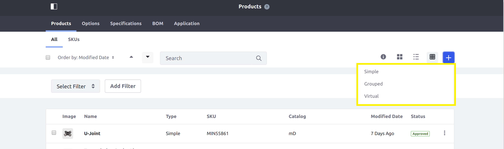

# Adding a New Product Type

This tutorial will show you how to add a new product type by implementing three interfaces: [CPType](https://github.com/liferay/com-liferay-commerce/blob/2.0.5/commerce-product-api/src/main/java/com/liferay/commerce/product/type/CPType.java), [ScreenNavigationCategory](https://github.com/liferay/liferay-portal/blob/7.1.3-ga4/modules/apps/frontend-taglib/frontend-taglib/src/main/java/com/liferay/frontend/taglib/servlet/taglib/ScreenNavigationCategory.java), and [ScreenNavigationEntry](https://github.com/liferay/liferay-portal/blob/7.1.3-ga4/modules/apps/frontend-taglib/frontend-taglib/src/main/java/com/liferay/frontend/taglib/servlet/taglib/ScreenNavigationEntry.java).

Product types can be used to group products that share similar characteristics. Liferay Commerce provides three product types out-of-the-box: [Simple](https://github.com/liferay/com-liferay-commerce/blob/2.0.5/commerce-product-type-simple/src/main/java/com/liferay/commerce/product/type/simple/internal/SimpleCPType.java), [Grouped](https://github.com/liferay/com-liferay-commerce/blob/2.0.5/commerce-product-type-grouped-web/src/main/java/com/liferay/commerce/product/type/grouped/web/internal/GroupedCPType.java), and [Virtual](https://github.com/liferay/com-liferay-commerce/blob/2.0.5/commerce-product-type-virtual-web/src/main/java/com/liferay/commerce/product/type/virtual/web/internal/VirtualCPType.java).



## Overview

1. [**Deploy an Example**](#deploy-an-example)
1. [**Walk Through the Example**](#walk-through-the-example)
1. [**Additional Information**](#additional-information)

## Deploy an Example

In this section, we will get an example product type up and running on your instance of Liferay Commerce. Follow these steps:

1. Start Liferay Commerce.

    ```bash
    docker run -it -p 8080:8080 liferay/commerce:2.0.5
    ```

1. Download and unzip [Acme Commerce Product Type]().

    ```bash
    curl liferay-c1n4.zip
    ```

    ```bash
    unzip liferay-c1n4.zip
    ```

1. Go to `liferay-c1n4`.

    ```bash
    cd liferay-c1n4
    ```

1. Build and deploy the example.

    ```bash
    ./gradlew deploy -Ddeploy.docker.container.id=$(docker ps -lq)
    ```

    >**Note:** This command is the same as copying the deployed jars to /opt/liferay/osgi/modules on the Docker container.

1. Confirm the deployment in the Liferay Docker container console.

    ```bash
    STARTED com.acme.c1n4.web_1.0.0
    ```

1. Verify that the example product type was added. Open your browser to `https://localhost:8080` and navigate to _Control Panel_ → _Commerce_ → _Products_. Then, click on the (+) icon to add a new product. The new product type ("Example") will be present in the list of types to choose from.


Congratulations, you've successfully built and deployed a new product type that implements `CPType`.

Next, let's dive deeper to learn more.

## Walk Through the Example

In this section, we will review the example we deployed. We will create two classes: a product type class and a screen navigation entry class for a custom screen. Walk through the following:

* [Annotate the Product Type Class for OSGi Registration](#annotate-the-product-type-class-for-osgi-registration)
* [Review the `CPType` Interface](#review-the-cptype-interface)
* [Annotate the Screen Navigation Entry Class for OSGi Registration](#annotate-the-screen-navigation-entry-class-for-osgi-registration)
* [Review the `ScreenNavigationCategory` Interface](#review-the-screennavigationcategory-interface)
* [Review the `ScreenNavigationEntry` Interface](#review-the-screennavigationentry-interface)
* [Complete the Product Type](#complete-the-product-type)

### Annotate the Product Type Class for OSGi Registration

Our product type class implements the `CPType` interface:

```java
@Component(
    immediate = true,
    property = {
        "commerce.product.type.display.order:Integer=16",
        "commerce.product.type.name=" + C1N4CPType.NAME
    },
    service = CPType.class
)
public class C1N4CPType implements CPType {

    public static final String NAME = "Example";
```

> The product type name must be a unique value so that Liferay Commerce can distinguish our product type from existing product types.
>
> The `commerce.product.type.display.order` value indicates how far into the list of product types our product type will appear in the UI. For example, the [virtual product type](https://github.com/liferay/com-liferay-commerce/blob/2.0.5/commerce-product-type-virtual-web/src/main/java/com/liferay/commerce/product/type/virtual/web/internal/VirtualCPType.java) has a value of 15. Giving our product type a value of 16 ensures that it will appear immediately after the virtual type.

### Review the `CPType` Interface

Implement the following methods of `CPType` in the product type class:

```java
public void deleteCPDefinition(long cpDefinitionId) throws PortalException;
```

> This method is where any custom deletion logic for the product type will be added.

```java
public String getLabel(Locale locale);
```

> This returns a text label that describes the product type. See the implementation in [C1N4CPType.java](./adding-a-new-product-type/liferay-c1n4.zip/c1n4-web/src/main/java/com/acme/c1n4/web/internal/commerce/product/type/C1N4CPType.java) for a reference in retrieving the label with a language key.

```java
public String getName();
```

> This returns the name of our product type. This name may be a language key that corresponds to the name that will appear in the UI.

### Annotate the Screen Navigation Entry Class for OSGi Registration

Our screen navigation entry class implements both the `ScreenNavigationCategory` and `ScreenNavigationEntry` interfaces:

```java
@Component(
    property = {
        "screen.navigation.category.order:Integer=11",
        "screen.navigation.entry.order:Integer=11"
    },
    service = {ScreenNavigationCategory.class, ScreenNavigationEntry.class}
)
public class C1N4ScreenNavigationEntry
    implements ScreenNavigationCategory, ScreenNavigationEntry<CPDefinition> {

    public static final String KEY = "Example";
```

> It is important to provide a distinct key for the navigation screen class so that Liferay Commerce can distinguish it as a separate screen from the existing screens. Reusing a key that is already in use will override the existing associated navigation screen.
>
> The `screen.navigation.category.order` and `screen.navigation.entry.order` values determine what position in the product type screens this screen will appear. For example, [the Details screen class](https://github.com/liferay/com-liferay-commerce/blob/2.0.5/commerce-product-definitions-web/src/main/java/com/liferay/commerce/product/definitions/web/internal/servlet/taglib/ui/CPDefinitionDetailsScreenNavigationEntry.java) has these values set to 10; setting them to 11 will ensure that our custom screen appears after it in the list.

### Review the `ScreenNavigationCategory` Interface

Implement the following methods in the screen navigation entry class:

```java
public String getCategoryKey();
```

> This returns a unique identifier for the category used for the screen navigation entry.

```java
public String getLabel(Locale var1);
```

> This returns a text label for the screen navigation entry that will be displayed in the UI. See the implementation in [C1N4ScreenNavigationEntry.java](./adding-a-new-product-type/liferay-c1n4.zip/c1n4-web/src/main/java/com/acme/c1n4/web/internal/servlet/taglib/ui/C1N4ScreenNavigationEntry.java) for a reference in retrieving the label with a language key.

```java
public String getScreenNavigationKey();
```

> This returns a key to indicate where our screen should appear in Liferay. Return the string value `"cp.definition.general"` so it properly appears among the other screens for products.

### Review the `ScreenNavigationEntry` Interface

Continue to build on the screen navigation entry class with the following methods:

```java
String getCategoryKey();
```

> This returns a unique identifier for the screen navigation category used by our screen.

```java
String getEntryKey();
```

> This returns a unique identifier for the screen navigation entry. It returns the same value as `getCategoryKey`.

```java
String getScreenNavigationKey();
```

> This is the same method as `getScreenNavigationKey` for the `ScreenNavigationCategory` interface. We implemented this method by returning the string value `"cp.definition.general"`.

```java
void render(
        HttpServletRequest var1, HttpServletResponse var2)
    throws IOException;
```

> This is where we add the code to render a customized screen for our product type.

### Complete the Product Type

The product type is comprised of backend logic for deleting the product, logic to render the screen in the navigation menu, and the custom screen itself. Do the following:

* [Configure the `ServletContext` for the module.](#configure-the-servletcontext-for-the-module)
* [Implement the `ScreenNavigationEntry`'s `render` method.](#implement-the-screennavigationentrys-render-method)
* [Override the `ScreenNavigationEntry`'s `isVisible` method.](#override-the-screennavigationentrys-isvisible-method)
* [Add the product type deletion logic to `deleteCPDefinition`.](#add-the-product-type-deletion-logic-to-deletecpdefinition)
* [Add a JSP to render the custom screen.](#add-a-jsp-to-render-the-custom-screen)
* [Add the language key to `Language.properties`.](#add-the-language-key-to-languageproperties)

#### Configure the `ServletContext` for the Module

Define the `ServletContext` in our `ScreenNavigationEntry` class using the symbolic name of our bundle so that it can find the JSP in our module:

```java
@Reference(target = "(osgi.web.symbolicname=com.acme.c1n4.web)")
private ServletContext _servletContext;
```

> The value we set for `osgi.web.symbolicname` matches the value for `Bundle-SymbolicName` in our [bnd.bnd file](./adding-a-new-product-type/liferay-c1n4.zip/c1n4-web/bnd.bnd). These values must match for the `ServletContext` to locate the JSP.
>
> We declare a unique value for `Web-ContextPath` in our bnd.bnd file so the `ServletContext` is correctly generated. In our example, `Web-ContextPath` is set to `/c1n4-web`. See [bnd.bnd](./adding-a-new-product-type/liferay-c1n4.zip/c1n4-web/bnd.bnd) for a reference on these values.

#### Implement the `ScreenNavigationEntry`'s `render` Method

```java
@Override
public void render(
        HttpServletRequest httpServletRequest,
        HttpServletResponse httpServletResponse)
    throws IOException {

    _jspRenderer.renderJSP(
        _servletContext, httpServletRequest, httpServletResponse,
        "/edit_product.jsp");
}
```

> Use a `JSPRenderer` to render the JSP for our product type's custom screen (in our example, [edit_product.jsp](./adding-a-new-product-type/liferay-c1n4.zip/c1n4-web/src/main/resources/META-INF/resources/edit_product.jsp)). Provide the `ServletContext` as a parameter to find the JSP we have created.

#### Override the `ScreenNavigationEntry`'s `isVisible` Method

```java
@Override
public boolean isVisible(User user, CPDefinition context) {
    if (context == null) {
        return false;
    }

    String productTypeName = context.getProductTypeName();

    if (productTypeName.equals(getCategoryKey())) {
        return true;
    }

    return false;
}
```

> Implement logic here to determine when to show the custom screen. In our example, we only check whether the product type from the `CPDefinition` matches our example product type.

#### Add the Product Type Deletion Logic to `deleteCPDefinition`

Our example does not require any logic to be added to `deleteCPDefinition`.

#### Add a JSP to Render the Custom Screen

In our example, we are adding a JSP with a text field.

```jsp
<%@ taglib uri="http://liferay.com/tld/aui" prefix="aui" %>

<aui:input name="exampleInput" type="text" />
```

> Implement any other inputs or actions desired on the custom screen here, such as a form or MVC action command. See [MVC Action Command](https://help.liferay.com/hc/en-us/articles/360018165091-MVC-Action-Command) for more information on adding an MVC action command that can be accessed from the JSP.

#### Add the Language Key to `Language.properties`

Add the language key and its value to a [Language.properties](./adding-a-new-product-type/liferay-c1n4.zip/c1n4-web/src/main/resources/content/Language.properties) file within our module:

```
example=Example
```

> See [Localizing Your Application](https://help.liferay.com/hc/en-us/articles/360018168251-Localizing-Your-Application) for more information.

## Conclusion

Congratulations! You now know the basics for implementing the `CPType` interface, and have implemented a new product type with its own custom screen to Liferay Commerce.

## Additional Information

* [Introduction to Product Types](../../user-guide/catalog/introduction-to-product-types.md)
* [Localizing Your Application](https://help.liferay.com/hc/en-us/articles/360018168251-Localizing-Your-Application)
