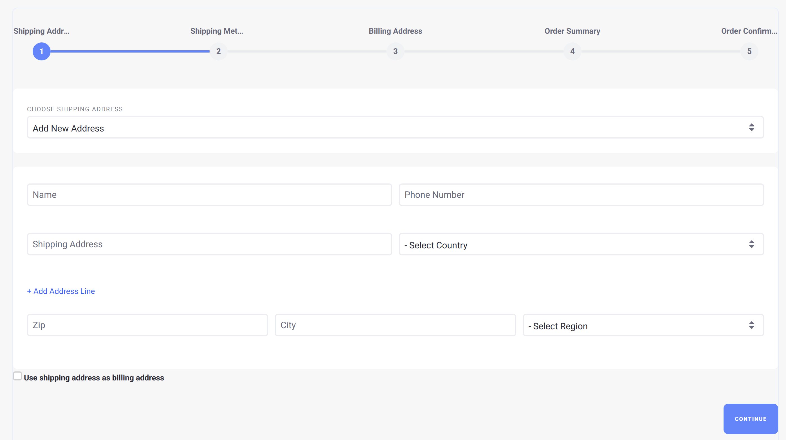
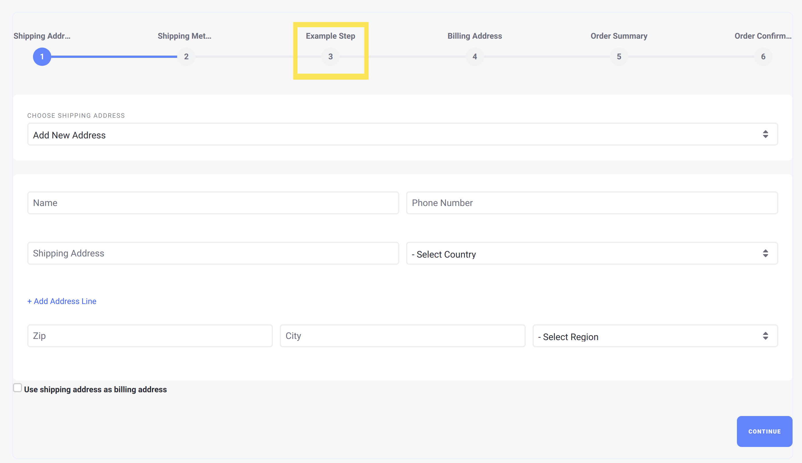

# Implementing a Custom Checkout Step

This tutorial will show you how to add a custom checkout step by implementing the [CommerceCheckoutStep](https://github.com/liferay/com-liferay-commerce/blob/2.0.5/commerce-api/src/main/java/com/liferay/commerce/util/CommerceCheckoutStep.java) interface.

A checkout step represents one screen of the checkout process for a customer. Liferay Commerce provides several checkout steps out-of-the-box, including essential steps like [the payment method step](https://github.com/liferay/com-liferay-commerce/blob/2.0.5/commerce-checkout-web/src/main/java/com/liferay/commerce/checkout/web/internal/util/PaymentMethodCommerceCheckoutStep.java) and the [order confirmation step](https://github.com/liferay/com-liferay-commerce/blob/2.0.5/commerce-checkout-web/src/main/java/com/liferay/commerce/checkout/web/internal/util/OrderConfirmationCommerceCheckoutStep.java).



## Overview

1. [**Deploy an Example**](#deploy-an-example)
1. [**Walk Through the Example**](#walk-through-the-example)
1. [**Additional Information**](#additional-information)

## Deploy an Example

In this section, we will get an example checkout step up and running on your instance of Liferay Commerce. Follow these steps:

1. Start Liferay Commerce.

    ```bash
    docker run -it -p 8080:8080 liferay/commerce:2.0.5
    ```

1. Download and unzip [Acme Commerce Checkout Step]().

    ```bash
    curl liferay-n8n6.zip
    ```

    ```bash
    unzip liferay-n8n6.zip
    ```

1. Go to `liferay-n8n6`.

    ```bash
    cd liferay-n8n6
    ```

1. Build and deploy the example.

    ```bash
    ./gradlew deploy -Ddeploy.docker.container.id=$(docker ps -lq)
    ```

    >**Note:** This command is the same as copying the deployed jars to /opt/liferay/osgi/modules on the Docker container.

1. Confirm the deployment in the Docker container console.

    ```bash
    STARTED com.acme.n8n6.web_1.0.0
    ```

1. Verify that the example checkout step was added. Open your browser to `https://localhost:8080` and navigate to a catalog on any Liferay Commerce site. Add an item to the cart, view the cart, and then click "Checkout". The new "Example Step" will be present in the list of checkout steps.



Congratulations, you've successfully built and deployed a new checkout step that implements `CommerceCheckoutStep`.

Next, let's dive deeper to learn more.

## Walk Through the Example

In this section, we will review the example we deployed. First, we will annotate the class for OSGi registration. Second, we will review the `CommerceCheckoutStep` interface. And third, we will complete our implementation of `CommerceCheckoutStep`.

> **Note:** To simplify implementing `CommerceCheckoutStep`, we extend `BaseCommerceCheckoutStep` for its base functionality.

### Annotate the Class for OSGi Registration

```java
@Component(
    immediate = true,
    property = {
        "commerce.checkout.step.name=" + N8N6CommerceCheckoutStep.NAME,
        "commerce.checkout.step.order:Integer=21"
    },
    service = CommerceCheckoutStep.class
)
public class N8N6CommerceCheckoutStep extends BaseCommerceCheckoutStep {

    public static final String NAME = "example-step";
```

> The checkout step name must be a unique value so that Liferay Commerce can distinguish our checkout step from existing checkout steps.
>
> The `commerce.checkout.step.order` value indicates how far into the checkout process the checkout step will appear. For example, the [shipping method checkout step](https://github.com/liferay/com-liferay-commerce/blob/2.0.5/commerce-checkout-web/src/main/java/com/liferay/commerce/checkout/web/internal/util/ShippingMethodCommerceCheckoutStep.java) has a value of 20. Giving our checkout step a value of 21 ensures that it will appear immediately after the shipping method step.

### Review the `CommerceCheckoutStep` Interface

Implement the following methods in addition to extending the base class:

```java
public String getName();
```

> This method returns the name of our checkout step. This name may be a language key that corresponds to the name that will appear in the UI.

```java
public void processAction(
        ActionRequest actionRequest, ActionResponse actionResponse)
    throws Exception;
```

> The `processAction` method may be used to implement business logic with the information passed through the `ActionRequest` if backend processing is required.

```java
public void render(
        HttpServletRequest httpServletRequest,
        HttpServletResponse httpServletResponse)
    throws Exception;
```

> This will be where we add the code to render a customized screen for our checkout step.

### Complete the Checkout Step

The checkout step is comprised of a custom screen and backend logic to process any input. Do the following:

* [Configure the `ServletContext` for the module.](#configure-the-servletcontext-for-the-module)
* [Implement the `render` method.](#implement-the-render-method)
* [Add business logic to `processAction`.](#add-business-logic-to-processaction)
* [Add a JSP to render the custom screen.](#add-a-jsp-to-render-the-custom-screen)
* [Add the language key to `Language.properties`.](#add-the-language-key-to-languageproperties)

#### Configure the `ServletContext` for the Module

Define the `ServletContext` using the symbolic name of our bundle so that it can find the JSP in our module:

```java
@Reference(target = "(osgi.web.symbolicname=com.acme.n8n6.web)")
private ServletContext _servletContext;
```

> The value we set for `osgi.web.symbolicname` matches the value for `Bundle-SymbolicName` in our [bnd.bnd file](./implementing-a-custom-checkout-step/liferay-n8n6.zip/n8n6-web/bnd.bnd). These values must match for the `ServletContext` to locate the JSP.
>
> We also need to declare a unique value for `Web-ContextPath` in our bnd.bnd file so the `ServletContext` is correctly generated. In our example, `Web-ContextPath` is set to `/n8n6-web`. See [bnd.bnd](./implementing-a-custom-checkout-step/liferay-n8n6.zip/n8n6-web/bnd.bnd) for a reference on these values.

#### Implement the `render` Method

```java
@Override
public void render(
        HttpServletRequest httpServletRequest,
        HttpServletResponse httpServletResponse)
    throws Exception {

    _jspRenderer.renderJSP(
        _servletContext, httpServletRequest, httpServletResponse,
        "/terms_and_conditions.jsp");
}
```

> Use a `JSPRenderer` to render the JSP for our checkout step (in this case, [terms_and_conditions.jsp](./implementing-a-custom-checkout-step/liferay-n8n6.zip/n8n6-web/src/main/resources/META-INF/resources/terms_and_conditions.jsp)). Provide the `ServletContext` as a parameter to find the JSP we have created.

#### Add Business Logic to `processAction`

Our example will display text on a custom screen and does not require backend processing in the `processAction` implementation.

#### Add a JSP to Render the Custom Screen

In our example, we are adding placeholder text. You can see the implementation at [terms_and_conditions.jsp](./implementing-a-custom-checkout-step/liferay-n8n6.zip/n8n6-web/src/main/resources/META-INF/resources/terms_and_conditions.jsp).

#### Add the Language Key to `Language.properties`

Add the language key and its value to a [Language.properties](./implementing-a-custom-checkout-step/liferay-n8n6.zip/n8n6-web/src/main/resources/content/Language.properties) file within our module:

```
example-step=Example Step
```

> See [Localizing Your Application](https://help.liferay.com/hc/en-us/articles/360018168251-Localizing-Your-Application) for more information.

## Conclusion

Congratulations! You now know the basics for implementing the `CommerceCheckoutStep` interface, and have added a new checkout step to Liferay Commerce.

## Additional Information

* [Checkout](../../user-guide/content/checkout.md)
* [Localizing Your Application](https://help.liferay.com/hc/en-us/articles/360018168251-Localizing-Your-Application)
