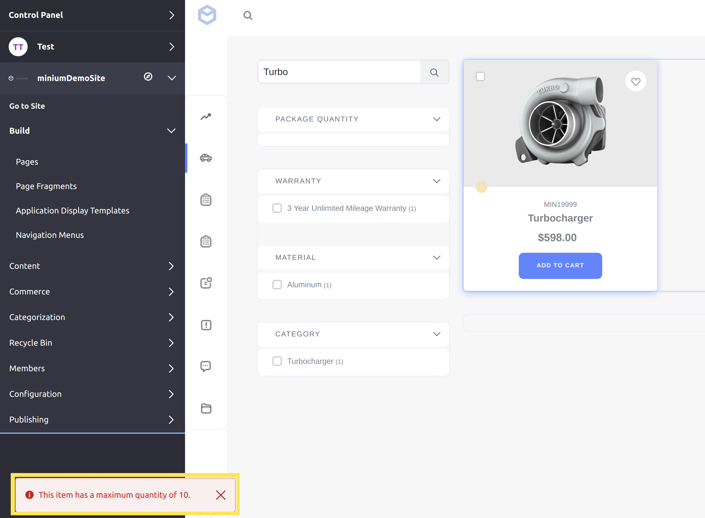

# Implementing a Custom Order Validator

This tutorial will show you how to add a custom order validator by implementing the [CommerceOrderValidator](https://github.com/liferay/com-liferay-commerce/blob/2.0.5/commerce-api/src/main/java/com/liferay/commerce/order/CommerceOrderValidator.java) interface.

An order validator is a class that validates items in a customer's cart when proceeding through checkout. Liferay Commerce provides multiple out-of-the-box order validators, including a [default](https://github.com/liferay/com-liferay-commerce/blob/2.0.5/commerce-service/src/main/java/com/liferay/commerce/internal/order/DefaultCommerceOrderValidatorImpl.java), as well as validators to check [item versions](https://github.com/liferay/com-liferay-commerce/blob/2.0.5/commerce-service/src/main/java/com/liferay/commerce/internal/order/VersionCommerceOrderValidatorImpl.java) and [recurring items (subscriptions)](https://github.com/liferay/com-liferay-commerce/blob/2.0.5/commerce-service/src/main/java/com/liferay/commerce/internal/order/SubscriptionCommerceOrderValidatorImpl.java).

## Overview

1. [**Deploy an Example**](#deploy-an-example)
1. [**Walk Through the Example**](#walk-through-the-example)
1. [**Additional Information**](#additional-information)

## Deploy an Example

In this section, we will get an example order validator up and running on your instance of Liferay Commerce. Follow these steps:

1. Start Liferay Commerce.

    ```bash
    docker run -it -p 8080:8080 liferay/commerce:2.0.5
    ```

1. Download and unzip [Acme Commerce Order Validator]().

    ```bash
    curl liferay-n9b2.zip
    ```

    ```bash
    unzip liferay-n9b2.zip
    ```

1. Go to `liferay-n9b2`.

    ```bash
    cd liferay-n9b2
    ```

1. Build and deploy the example.

    ```bash
    ./gradlew deploy -Ddeploy.docker.container.id=$(docker ps -lq)
    ```

    > **Note:** This command is the same as copying the deployed jars to /opt/liferay/osgi/modules on the Docker container.

1. Confirm the deployment in the Docker container console.

    ```bash
    STARTED com.acme.n9b2.impl_1.0.0
    ```

1. Verify that the example order validator was added by viewing the failure message. Open your browser to `https://localhost:8080` and navigate to a catalog with at least one item priced over $100. If no such product exists yet, add it yourself; see [Creating a Simple Product](../../../user-guide/catalog/creating-and-managing-products/product-types/creating-a-simple-product) for more information.

    From the catalog, find the item with this price, then click "Add to Cart". Increase the quantity to 11 or more, then click the arrow to continue. The error message that appears shows that the custom order validator successfully rejected adding the item.

    

Congratulations, you've successfully built and deployed a new order validator that implements `CommerceOrderValidator`.

Next, let's dive deeper to learn more.

## Walk Through the Example

In this section, we will review the example we deployed. First, we will annotate the class for OSGi registration. Second, we will review the `CommerceOrderValidator` interface. And third, we will complete our implementation of `CommerceOrderValidator`.

### Annotate the Class for OSGi Registration

```java
@Component(
    immediate = true,
    property = {
        "commerce.order.validator.key=" + N9B2CommerceOrderValidator.KEY,
        "commerce.order.validator.priority:Integer=9"
    },
    service = CommerceOrderValidator.class
)
public class N9B2CommerceOrderValidator implements CommerceOrderValidator {

    public static final String KEY = "Example";
```

> It is important to provide a distinct key for the order validator so that Liferay Commerce can distinguish the new order validator from others in the [order validator registry](https://github.com/liferay/com-liferay-commerce/blob/2.0.5/commerce-service/src/main/java/com/liferay/commerce/internal/order/CommerceOrderValidatorRegistryImpl.java). Reusing a key that is already in use will override the existing associated validator.
>
> The `commerce.order.validator.priority` value indicates when the order validator will perform its validation in sequence with other validators. For example, the [default order validator](https://github.com/liferay/com-liferay-commerce/blob/2.0.5/commerce-service/src/main/java/com/liferay/commerce/internal/order/DefaultCommerceOrderValidatorImpl.java) has a value of 10. Giving our order validator a value of 9 ensures that it will perform its validation immediately before the default validator.

### Review the `CommerceOrderValidator` Interface

Implement the following methods:

```java
public String getKey();
```

> This method provides a unique identifier for the order validator in the order validator registry. The key can be used to fetch the validator from the registry. Reusing a key that is already in use will override the existing associated validator.

```java
public CommerceOrderValidatorResult validate(Locale locale, CommerceOrder commerceOrder, CPInstance cpInstance, int quantity) throws PortalException;
```

> This is one of the two validation methods where we will add our custom validation logic. This method is called whenever a customer adds an item to their cart. It does this by returning a `CommerceOrderValidatorResult`, which uses a boolean to signal whether or not the result passes validation; see [CommerceOrderValidatorResult.java](https://github.com/liferay/com-liferay-commerce/blob/2.0.5/commerce-api/src/main/java/com/liferay/commerce/order/CommerceOrderValidatorResult.java).

```java
public CommerceOrderValidatorResult validate(Locale locale, CommerceOrderItem commerceOrderItem) throws PortalException;
```
> This is the second validation method where we can add custom validation logic. This method is called for items already in the cart, whenever a customer proceeds to a new step in checkout.

### Complete the Order Validator

The order validator is comprised of validation logic for both adding a product to the cart and proceeding to a new checkout step. Do the following:

* [Add validation logic for adding a product to cart.](#add-validation-logic-for-adding-a-product-to-cart)
* [Add validation logic for proceeding in checkout.](#add-validation-logic-for-proceeding-in-checkout)
* [Add the language keys to `Language.properties`.](#add-the-language-keys-to-languageproperties)

The two `validate` methods are where we define the custom validation logic for our order validator. In our example, we will add logic to reject orders with more than ten of an item over a certain price.

#### Add Validation Logic for Adding a Product to Cart

```java
@Override
public CommerceOrderValidatorResult validate(
        Locale locale, CommerceOrder commerceOrder, CPInstance cpInstance,
        int quantity)
    throws PortalException {

    if (cpInstance == null) {
        return new CommerceOrderValidatorResult(false);
    }

    BigDecimal price = cpInstance.getPrice();

    if ((price.doubleValue() > 100.0) && (quantity > 10)) {
        ResourceBundle resourceBundle = ResourceBundleUtil.getBundle(
            "content.Language", locale, getClass());

        return new CommerceOrderValidatorResult(
            false,
            LanguageUtil.get(
                resourceBundle, "this-item-has-a-maximum-quantity-of-10"));
    }

    return new CommerceOrderValidatorResult(true);
}
```

> The main validation check for our example is to check if both the price (stored as a `BigDecimal`) is more than $100, and the quantity is greater than ten. We get the price information from the `CPInstance`, which contains information about the order the customer has added. To find more methods you can use with a `CPInstance`, see [CPInstance](https://github.com/liferay/com-liferay-commerce/blob/2.0.5/commerce-product-api/src/main/java/com/liferay/commerce/product/model/CPInstance.java) and [CPInstanceModel](https://github.com/liferay/com-liferay-commerce/blob/2.0.5/commerce-product-api/src/main/java/com/liferay/commerce/product/model/CPInstanceModel.java).
>
> Note that it is best practice to include a localized message explaining why the validation failed for the main validation checks.

#### Add Validation Logic for Proceeding in Checkout

```java
@Override
public CommerceOrderValidatorResult validate(
        Locale locale, CommerceOrderItem commerceOrderItem)
    throws PortalException {

    BigDecimal price = commerceOrderItem.getUnitPrice();

    if ((price.doubleValue() > 100.0) &&
        (commerceOrderItem.getQuantity() > 10)) {

        ResourceBundle resourceBundle = ResourceBundleUtil.getBundle(
            "content.Language", locale, getClass());

        return new CommerceOrderValidatorResult(
            false,
            LanguageUtil.get(
                resourceBundle,
                "expensive-items-have-a-maximum-quantity-of-10"));
    }

    return new CommerceOrderValidatorResult(true);
}
```

> Add the same validation logic to this method, since it will be called for the items in the customer's cart. The main difference in this case is we get the information from a `CommerceOrderItem` object; see [CommerceOrderItem](https://github.com/liferay/com-liferay-commerce/blob/2.0.5/commerce-api/src/main/java/com/liferay/commerce/model/CommerceOrderItem.java) and [CommerceOrderItemModel](https://github.com/liferay/com-liferay-commerce/blob/2.0.5/commerce-api/src/main/java/com/liferay/commerce/model/CommerceOrderItemModel.java) to find more methods you can use with a `CommerceOrderItem`.

#### Add the Language Keys to `Language.properties`

Add the language keys and their values to a [Language.properties](./implementing-a-custom-order-validator/liferay-n9b2.zip/n9b2-impl/src/main/resources/content/Language.properties) file within our module:

```
expensive-items-have-a-maximum-quantity-of-10=Expensive items have a maximum quantity of 10.
this-item-has-a-maximum-quantity-of-10=This item has a maximum quantity of 10.
```

> See [Localizing Your Application](https://help.liferay.com/hc/en-us/articles/360018168251-Localizing-Your-Application) for more information.

## Conclusion

Congratulations! You now know the basics for implementing the `CommerceOrderValidator` interface, and have added a new order validator to Liferay Commerce.

## Additional Information

* [Creating a Simple Product](../../user-guide/catalog/creating-a-simple-product.md)
* [Localizing Your Application](https://help.liferay.com/hc/en-us/articles/360018168251-Localizing-Your-Application)
