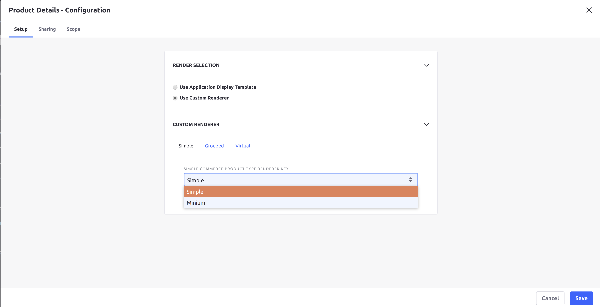
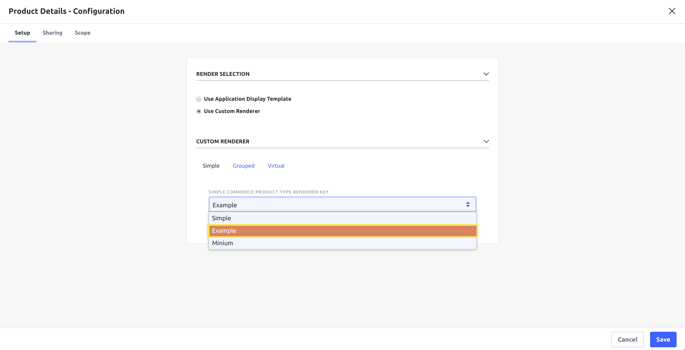

# Implementing a Custom Product Content Renderer

This tutorial will show you how to add a custom product content renderer by implementing the [CPContentRenderer](https://github.com/liferay/com-liferay-commerce/blob/2.0.5/commerce-product-content-api/src/main/java/com/liferay/commerce/product/content/render/CPContentRenderer.java) interface.

A product content renderer provides a style of displaying product details for a specific [product type](../../user-guide/catalog/introduction-to-product-types.md), in a variety of widgets that can display products. Liferay Commerce provides product content renderers for each out-of-the-box product type, such as [SimpleCPContentRenderer](https://github.com/liferay/com-liferay-commerce/blob/2.0.5/commerce-product-type-simple/src/main/java/com/liferay/commerce/product/type/simple/internal/SimpleCPContentRenderer.java) for Simple products.



## Overview

1. [**Deploy an Example**](#deploy-an-example)
1. [**Walk Through the Example**](#walk-through-the-example)
1. [**Additional Information**](#additional-information)

## Deploy an Example

In this section, we will get an example product content renderer up and running on your instance of Liferay Commerce. Follow these steps:

1. Start Liferay Commerce.

    ```bash
    docker run -it -p 8080:8080 liferay/commerce:2.0.5
    ```

1. Download and unzip [Acme Commerce Product Content Renderer]().

    ```bash
    curl liferay-q4f7.zip
    ```

    ```bash
    unzip liferay-q4f7.zip
    ```

1. Go to `liferay-q4f7`.

    ```bash
    cd liferay-q4f7
    ```

1. Build and deploy the example.

    ```bash
    ./gradlew deploy -Ddeploy.docker.container.id=$(docker ps -lq)
    ```

    >**Note:** This command is the same as copying the deployed jars to /opt/liferay/osgi/modules on the Docker container.

1. Confirm the deployment in the Docker container console.

    ```bash
    STARTED com.acme.q4f7.web_1.0.0
    ```

1. Verify that the example product content renderer was added. Open your browser to `https://localhost:8080` and navigate to any catalog with products in Liferay Commerce. Click on the product to see the Product Details widget, then click _Configuration_ for the widget.

    Under the _Custom Renderer_ section, select _Simple_. Below the _Simple Commerce Product Type Renderer Key_ dropdown, the new renderer ("Example") will be present.



Congratulations, you've successfully built and deployed a new custom product content renderer that implements `CPContentRenderer`.

Next, let's dive deeper to learn more.

## Walk Through the Example

In this section, we will review the example we deployed. First, we will annotate the class for OSGi registration. Second, we will review the `CPContentRenderer` interface. And third, we will complete our implementation of `CPContentRenderer`.

### Annotate the Class for OSGi Registration

```java
@Component(
    immediate = true,
    property = {
        "commerce.product.content.renderer.key=" + Q4F7CPContentRenderer.KEY,
        "commerce.product.content.renderer.order=" + 1,
        "commerce.product.content.renderer.type=" + SimpleCPTypeConstants.NAME
    },
    service = CPContentRenderer.class
)
public class Q4F7CPContentRenderer implements CPContentRenderer {

    public static final String KEY = "Example";
```

> It is important to provide a distinct key for the product content renderer so that Liferay Commerce can distinguish the new renderer from others in the [product content renderer registry](https://github.com/liferay/com-liferay-commerce/blob/2.0.5/commerce-product-content-web/src/main/java/com/liferay/commerce/product/content/web/internal/render/CPContentRendererRegistryImpl.java). Reusing a key that is already in use will override the existing associated renderer.
>
> The `commerce.product.content.renderer.order` property determines the ordering of renderers in the UI, from lowest to highest value. For example, the [SimpleCPContentRenderer](https://github.com/liferay/com-liferay-commerce/blob/2.0.5/commerce-product-type-simple/src/main/java/com/liferay/commerce/product/type/simple/internal/SimpleCPContentRenderer.java) has this property set to the minimum integer value, so other renderers for Simple type products will appear after it in the list.
>
> The `commerce.product.content.renderer.type` property determines what type of product this renderer can be used for. In our example, we use a Simple type, so the renderer will appear under the Simple category in the UI.

### Review the `CPContentRenderer` Interface

Implement the following methods:

```java
public String getKey();
```

> This method provides a unique identifier for the product content renderer in the product content renderer registry. The key can be used to fetch the renderer from the registry. Reusing a key that is already in use will override the existing associated renderer.

```java
public String getLabel(Locale locale);
```

> This returns a text label that describes the product content renderer. See the implementation in [Q4F7CPContentRenderer.java](./implementing-a-custom-product-content-renderer/liferay-q4f7.zip/q4f7-web/src/main/java/com/acme/q4f7/web/internal/commerce/product/content/renderer/Q4F7CPContentRenderer.java) for a reference in retrieving the label with a language key.

```java
public void render(
        CPCatalogEntry cpCatalogEntry,
        HttpServletRequest httpServletRequest,
        HttpServletResponse httpServletResponse)
    throws Exception;
```

> This is where we add the code to render a customized view for our product content renderer.
>
> There are several ways to define a view: JSP, Freemarker template, or Soy template. In our example, we will use a JSP.

### Complete the Product Content Renderer

The product content renderer is comprised of a custom view that we define and render. Do the following:

* [Configure the `ServletContext` for the module.](#configure-the-servletcontext-for-the-module)
* [Implement the `render` method.](#implement-the-render-method)
* [Add a JSP for the custom view.](#add-a-jsp-for-the-custom-view)
* [Add the language key to `Language.properties`.](#add-the-language-key-to-languageproperties)

#### Configure the `ServletContext` for the Module

Define the `ServletContext` using the symbolic name of our bundle so that it can find the JSP in our module:

```java
@Reference(
    target = "(osgi.web.symbolicname=com.acme.q4f7.web)"
)
private ServletContext _servletContext;
```

> The value we set for `osgi.web.symbolicname` matches the value for `Bundle-SymbolicName` in our [bnd.bnd file](./implementing-a-custom-product-content-renderer/liferay-q4f7.zip/q4f7-web/bnd.bnd). These values must match for the `ServletContext` to locate the JSP
>
> We also need to declare a unique value for `Web-ContextPath` in our bnd.bnd file so the `ServletContext` is correctly generated. In our example, `Web-ContextPath` is set to `/q4f7-web`. See [bnd.bnd](./implementing-a-custom-product-content-renderer/liferay-q4f7.zip/q4f7-web/bnd.bnd) for a reference on these values.

#### Implement the `render` Method

```java
@Override
public void render(
        CPCatalogEntry cpCatalogEntry,
        HttpServletRequest httpServletRequest,
        HttpServletResponse httpServletResponse)
    throws Exception {

    _jspRenderer.renderJSP(
        _servletContext, httpServletRequest, httpServletResponse,
        "/view.jsp");
}
```

> Use a `JSPRenderer` to render the JSP for our product content renderer (in this case, [view.jsp](./implementing-a-custom-product-content-renderer/liferay-q4f7.zip/q4f7-web/src/main/resources/META-INF/resources/view.jsp)). Provide the `ServletContext` as a parameter to find the JSP we have created.

#### Add a JSP for the Custom View

```jsp
<%
CPContentHelper cpContentHelper = (CPContentHelper)request.getAttribute(CPContentWebKeys.CP_CONTENT_HELPER);

CPCatalogEntry cpCatalogEntry = cpContentHelper.getCPCatalogEntry(request);

CPSku cpSku = cpContentHelper.getDefaultCPSku(cpCatalogEntry);

long cpDefinitionId = cpCatalogEntry.getCPDefinitionId();
%>
```

> [CPContentHelper](https://github.com/liferay/com-liferay-commerce/blob/2.0.5/commerce-product-content-web/src/main/java/com/liferay/commerce/product/content/web/internal/util/CPContentHelperImpl.java) is a class that retrieves information about a particular product.
>
> [CPCatalogEntry](https://github.com/liferay/com-liferay-commerce/blob/2.0.5/commerce-product-api/src/main/java/com/liferay/commerce/product/catalog/CPCatalogEntry.java) represents the displayed product itself. We get more information about the product with its default SKU, contained in a [CPSku](https://github.com/liferay/com-liferay-commerce/blob/2.0.5/commerce-product-service/src/main/java/com/liferay/commerce/product/internal/catalog/CPSkuImpl.java) object.

```jsp
<h1>Example Product Renderer</h1>

<c:if test="<%= cpSku != null %>">
    <h3><%= "SKU: " + cpSku.getSku() %></h3>

    <h3><%= "Price: " + cpSku.getPrice().toString() %></h3>

    <h3><%= "Availability: " + cpContentHelper.getAvailabilityLabel(request) %></h3>

    <h3><%= "Stock Quantity: " + cpContentHelper.getStockQuantityLabel(request) %></h3>
</c:if>

<liferay-util:dynamic-include key="com.liferay.commerce.product.content.web#/add_to_cart#" />
```

> We use Liferay Commerce's [add_to_cart_button.jsp](https://github.com/liferay/com-liferay-commerce/blob/2.0.5/commerce-cart-content-web/src/main/resources/META-INF/resources/dynamic_include/add_to_cart_button.jsp) to insert the "Add to Cart" feature to our view.

#### Add the Language Key to `Language.properties`

Add the language key and its value to a [Language.properties](./implementing-a-custom-product-content-renderer/liferay-q4f7.zip/q4f7-web/src/main/resources/content/Language.properties) file within our module:

```
example=Example
```

> See [Localizing Your Application](https://help.liferay.com/hc/en-us/articles/360018168251-Localizing-Your-Application) for more information.

## Conclusion

Congratulations! You now know the basics for implementing the `CPContentRenderer` interface, and have added a new product content renderer to Liferay Commerce.

## Additional Information

* [Introduction to Product Types](../../user-guide/catalog/introduction-to-product-types.md)
* [Localizing Your Application](https://help.liferay.com/hc/en-us/articles/360018168251-Localizing-Your-Application)
