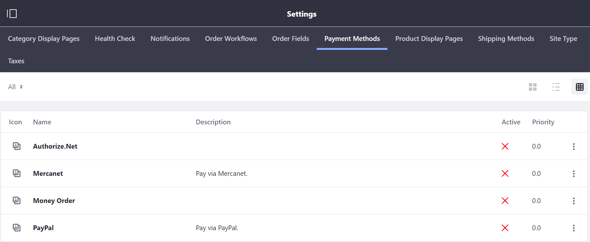
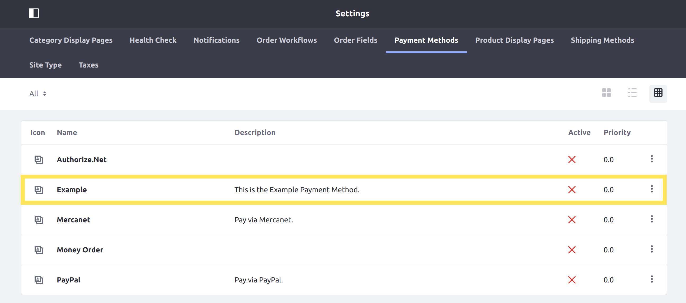

# Implementing a New Payment Method

This tutorial will show you how to add a new payment method by implementing the [CommercePaymentMethod](https://github.com/liferay/com-liferay-commerce/blob/2.0.5/commerce-api/src/main/java/com/liferay/commerce/payment/method/CommercePaymentMethod.java) interface.

Payment methods represent various ways customers can pay for orders. Liferay Commerce provides several out-of-the-box payment methods including [Authorize.Net](https://github.com/liferay/com-liferay-commerce/blob/2.0.5/commerce-payment-method-authorize-net/src/main/java/com/liferay/commerce/payment/method/authorize/net/internal/AuthorizeNetCommercePaymentMethod.java), [Mercanet](https://github.com/liferay/com-liferay-commerce/blob/2.0.5/commerce-payment-method-mercanet/src/main/java/com/liferay/commerce/payment/method/mercanet/internal/MercanetCommercePaymentMethod.java), [Money Order](https://github.com/liferay/com-liferay-commerce/blob/2.0.5/commerce-payment-method-money-order/src/main/java/com/liferay/commerce/payment/method/money/order/internal/MoneyOrderCommercePaymentMethod.java), and [PayPal](https://github.com/liferay/com-liferay-commerce/blob/2.0.5/commerce-payment-method-paypal/src/main/java/com/liferay/commerce/payment/method/paypal/internal/PayPalCommercePaymentMethod.java).



## Overview

1. [**Deploy an Example**](#deploy-an-example)
1. [**Walk Through the Example**](#walk-through-the-example)
1. [**Additional Information**](#additional-information)

## Deploy an Example

In this section, we will get an example payment method up and running on your instance of Liferay Commerce. Follow these steps:

1. Start Liferay Commerce.

    ```bash
    docker run -it -p 8080:8080 liferay/commerce:2.0.5
    ```

1. Download and unzip [Acme Commerce Payment Method]().

    ```bash
    curl liferay-b1c3.zip
    ```

    ```bash
    unzip liferay-b1c3.zip
    ```

1. Go to `liferay-b1c3`.

    ```bash
    cd liferay-b1c3
    ```

1. Build and deploy the example.

    ```bash
    ./gradlew deploy -Ddeploy.docker.container.id=$(docker ps -lq)
    ```

    >**Note:** This command is the same as copying the deployed jars to /opt/liferay/osgi/modules on the Docker container.

1. Confirm the deployment in the Docker container console.

    ```bash
    STARTED com.acme.b1c3.impl_1.0.0
    ```

1. Verify that the example payment method was added. Open your browser to `https://localhost:8080` and navigate to _Site Administration_ → _Commerce_ → _Settings_ → _Payment Methods_.

   

Congratulations, you've successfully built and deployed a new payment method that implements `CommercePaymentMethod`.

Next, let's dive deeper to learn more.

## Walk Through the Example

In this section, we will review the example we deployed. First, we will annotate the class for OSGi registration. Second, we will review the `CommercePaymentMethod` interface. And third, we will complete our implementation of `CommercePaymentMethod`.

### Annotate the Class for OSGi Registration

```java
@Component(
	immediate = true,
	property = "commerce.payment.engine.method.key=" + B1C3CommercePaymentMethod.KEY,
	service = CommercePaymentMethod.class
)
public class B1C3CommercePaymentMethod implements CommercePaymentMethod {

	public static final String KEY = "Example";
```

>It is important to provide a distinct key for the payment method so that Liferay Commerce can distinguish our new payment method from others in the [payment method registry](https://github.com/liferay/com-liferay-commerce/blob/2.0.5/commerce-payment-service/src/main/java/com/liferay/commerce/payment/internal/method/CommercePaymentMethodRegistryImpl.java). Reusing a key that is already in use will override the existing associated payment method.

### Review the `CommercePaymentMethod` Interface

Implement the following methods:

```java
	public String getDescription(Locale locale);
```

> This populates the "Description" column in the _Payment Methods_ administration page. See the implementation in [B1C3CommercePaymentMethod.java](./implementing-a-new-payment-method/liferay-b1c3.zip/b1c3-impl/src/main/java/com/acme/b1c3/internal/commerce/payment/method/B1C3CommercePaymentMethod.java) for a reference in retrieving the description with a language key.

```java
	public String getKey();
```

>This provides a unique identifier for the payment method in the payment method registry. The key can be used to fetch the payment method from the registry. Reusing a key that is already in use will override the existing associated payment method.

```java
	public String getName(Locale locale);
```

> This populates the "Name" column in the _Payment Methods_ administration page. It works similarly to the `getDescription` method.

```java
	public int getPaymentType();
```

>This identifies how the payment engine will use a given payment method.
>
> We use the value `COMMERCE_PAYMENT_METHOD_TYPE_OFFLINE` to inform the payment engine that there are no online processing requirements for this payment method. There are two other payment type constants available out-of-the-box: `COMMERCE_PAYMENT_METHOD_TYPE_ONLINE_STANDARD` and `COMMERCE_PAYMENT_METHOD_TYPE_ONLINE_REDIRECT`.

```java
	public String getServletPath();
```

> A servlet may be required to enable proper interfacing with an external payment provider for online payment methods. Since no servlet path is required for an offline payment method, `getServletPath` must return `null`.

### Complete the Payment Method

The payment method is comprised of backend logic for processing and completing payments, as well as many more optional custom behaviors. Do the following:

* [Implement payment processing logic.](#implement-payment-processing-logic)
* [Implement payment completion logic.](#implement-payment-completion-logic)
* [Implement optional methods.](#implement-optional-methods)
* [Add the language keys to `Language.properties`.](#add-the-language-keys-to-languageproperties)

#### Implement Payment Processing Logic

```java
@Override
public boolean isProcessPaymentEnabled() {
	return true;
}
```

>This method must return true for the payment method to process payments. This informs the payment engine what functionality is supported by our payment method.

```java
@Override
public CommercePaymentResult processPayment(
		CommercePaymentRequest commercePaymentRequest)
	throws Exception {

	return new CommercePaymentResult(
		null, commercePaymentRequest.getCommerceOrderId(),
		CommerceOrderConstants.PAYMENT_STATUS_AUTHORIZED, false, null, null,
		Collections.emptyList(), true);
}
```

>Implement custom payment logic in this method. The `CommercePaymentResult` should store information relevant to the processing of a payment. See [CommercePaymentResult.java](https://github.com/liferay/com-liferay-commerce/blob/2.0.5/commerce-api/src/main/java/com/liferay/commerce/payment/result/CommercePaymentResult.java) for more information.

#### Implement Payment Completion Logic

```java
@Override
public boolean isCompleteEnabled() {
	return true;
}
```

>This must return true for the payment method to complete payments. This informs the payment engine what functionality is supported by our payment method.

```java
@Override
public CommercePaymentResult completePayment(
		CommercePaymentRequest commercePaymentRequest)
	throws Exception {

	return new CommercePaymentResult(
		null, commercePaymentRequest.getCommerceOrderId(),
		CommerceOrderConstants.PAYMENT_STATUS_PAID, false, null, null,
		Collections.emptyList(), true);
}
```

>Implement custom payment completion logic in this method.  `CommercePaymentResult` is a container that stores information relevant to the completion of a payment process. See [CommercePaymentResult.java](https://github.com/liferay/com-liferay-commerce/blob/2.0.5/commerce-api/src/main/java/com/liferay/commerce/payment/result/CommercePaymentResult.java) for more information.

#### Implement Optional Methods

There are additional methods that may be implemented to provide additional functionality, such as subscriptions, recurring payments, and refunds. These can be seen in [CommercePaymentMethod.java](https://github.com/liferay/com-liferay-commerce/blob/2.0.5/commerce-api/src/main/java/com/liferay/commerce/payment/method/CommercePaymentMethod.java). These methods come in pairs: one method to enable and the other to implement a given piece of functionality.

Many of these methods are important for payment methods using online APIs. See [PayPalCommercePaymentMethod](https://github.com/liferay/com-liferay-commerce/blob/2.0.5/commerce-payment-method-paypal/src/main/java/com/liferay/commerce/payment/method/paypal/internal/PayPalCommercePaymentMethod.java) for an example of an online payment method.

Our example does not override any of these optional methods.

#### Add the Language Keys to `Language.properties`

Add the language keys and their values to a [Language.properties](./implementing-a-new-payment-method/liferay-b1c3.zip/b1c3-impl/src/main/resources/content/Language.properties) file within our module:

```
example=Example
this-is-the-example-payment-method=This is the Example Payment Method.
```

> See [Localizing Your Application](https://help.liferay.com/hc/en-us/articles/360018168251-Localizing-Your-Application) for more information.

## Conclusion

Congratulations! You now know the basics for implementing the `CommercePaymentMethod` interface and have added a new payment method to Liferay Commerce.

## Additional Information

* [Localizing Your Application](https://help.liferay.com/hc/en-us/articles/360018168251-Localizing-Your-Application)
