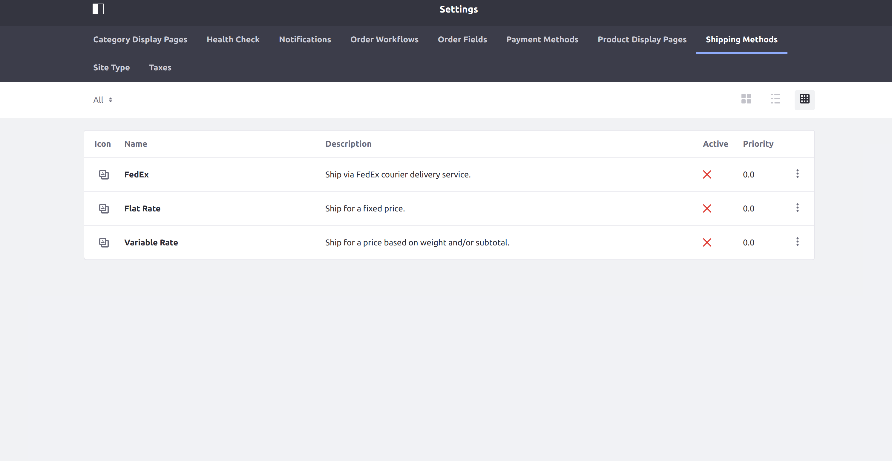
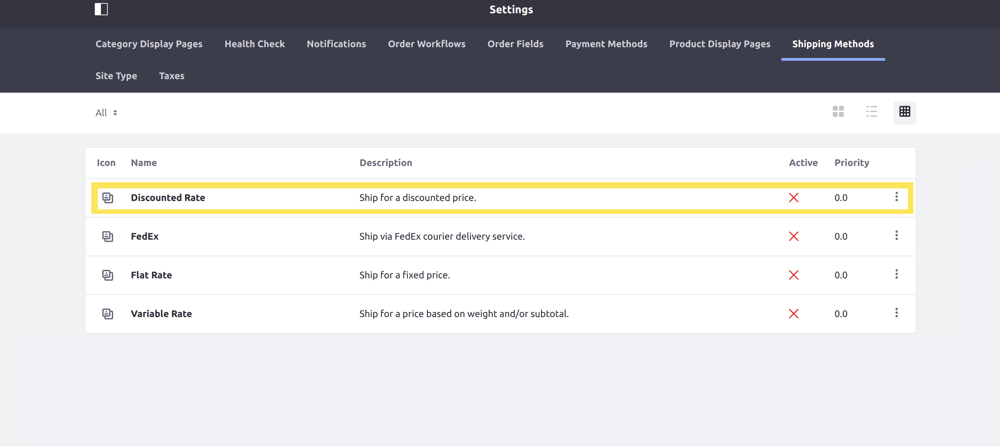

# Implementing a New Shipping Engine

This tutorial will show you how to add a custom shipping engine by implementing the [CommerceShippingEngine](https://github.com/liferay/com-liferay-commerce/blob/2.0.5/commerce-api/src/main/java/com/liferay/commerce/model/CommerceShippingEngine.java) interface.

Shipping engines process shipping options to determine which of the available options will be shown to the user, for what price, and so on. Liferay Commerce provides three shipping engines out-of-the-box: a [flat rate engine](https://github.com/liferay/com-liferay-commerce/blob/2.0.5/commerce-shipping-engine-fixed-web/src/main/java/com/liferay/commerce/shipping/engine/fixed/web/internal/FixedCommerceShippingEngine.java), a [variable rate engine](https://github.com/liferay/com-liferay-commerce/blob/2.0.5/commerce-shipping-engine-fixed-web/src/main/java/com/liferay/commerce/shipping/engine/fixed/web/internal/ByWeightCommerceShippingEngine.java), and the [FedEx engine](https://github.com/liferay/com-liferay-commerce/blob/2.0.5/commerce-shipping-engine-fedex/src/main/java/com/liferay/commerce/shipping/engine/fedex/internal/FedExCommerceShippingEngine.java).

>The FedEx shipping engine is only available for Commerce Enterprise Subscribers.



## Overview

1. [**Deploy an Example**](#deploy-an-example)
1. [**Walk Through the Example**](#walk-through-the-example)
1. [**Additional Information**](#additional-information)

## Deploy an Example

In this section, we will get an example shipping engine up and running on your instance of Liferay Commerce. Follow these steps:

1. Start Liferay Commerce.

    ```bash
    docker run -it -p 8080:8080 liferay/commerce:2.0.5
    ```

1. Download and unzip [Acme Commerce Shipping Engine]()

    ```bash
    curl liferay-j6x8.zip
    ```

    ```bash
    unzip liferay-j6x8.zip
    ```

1. Go to `liferay-j6x8`.

    ```bash
    cd liferay-j6x8
    ```

1. Build and deploy the example.

    ```bash
    ./gradlew deploy -Ddeploy.docker.container.id=$(docker ps -lq)
    ```

    >**Note:** This command is the same as copying the deployed jars to /opt/liferay/osgi/modules on the Docker container.

1. Confirm the deployment in the Docker container console.

    ```bash
    STARTED com.acme.j6x8.impl_1.0.0
    ```

1. Verify that the example shipping engine was added. Open your browser to `https://localhost:8080` and navigate to _Site Administration_ → _Commerce_ → _Settings_ → _Shipping Methods_. The new shipping method ("Discounted Rate") representing our shipping engine will be present on this screen.



Congratulations, you've successfully built and deployed a new shipping engine that implements `CommerceShippingEngine`.

Next, let's dive deeper to learn more.

## Walk Through the Example

In this section, we will review the example we deployed. First, we will annotate the class for OSGi registration. Second, we will review the `CommerceShippingEngine` interface. And third, we will complete our implementation of `CommerceShippingEngine`.

### Annotate the Class for OSGi Registration

```java
@Component(
    immediate = true,
    property = "commerce.shipping.engine.key=" + J6X8CommerceShippingEngine.KEY,
    service = CommerceShippingEngine.class
)
public class J6X8CommerceShippingEngine implements CommerceShippingEngine {

    public static final String KEY = "Example";
```

> It is important to provide a distinct key for the shipping engine so that Liferay Commerce can distinguish the new engine from others in the [shipping engine registry](https://github.com/liferay/com-liferay-commerce/blob/2.0.5/commerce-service/src/main/java/com/liferay/commerce/internal/util/CommerceShippingEngineRegistryImpl.java). Reusing a key that is already in use will override the existing associated engine.

### Review the `CommerceShippingEngine` Interface

Implement the following methods:

```java
public String getCommerceShippingOptionLabel(String name, Locale locale);
```

> This method returns a text label used for shipping options. See the implementation in [J6X8CommerceShippingEngine.java](./implementing-a-new-shipping-engine/liferay-j6x8.zip/j6x8-impl/src/main/java/com/acme/j6x8/internal/commerce/model/J6X8CommerceShippingEngine.java) for a reference in retrieving the description with a language key.
>
> See [Localizing Your Application](https://help.liferay.com/hc/en-us/articles/360018168251-Localizing-Your-Application) for more information.

```java
public List<CommerceShippingOption> getCommerceShippingOptions(
        CommerceContext commerceContext, CommerceOrder commerceOrder,
        Locale locale)
    throws CommerceShippingEngineException;
```

> This will be where we add the business logic for our custom shipping engine. It must fetch a list of available options, then perform the processing necessary to present them to the customer.

```java
public String getDescription(Locale locale);
```

> This returns a brief description of our shipping engine. It works similarly to the `getCommerceShippingOptionLabel` method.

```java
public String getName(Locale locale);
```

> This returns the name of our shipping engine to display in the UI. It also works similarly to the `getCommerceShippingOptionLabel` and `getDescription` methods.

### Complete the Shipping Engine

The shipping engine is comprised of backend logic preparing the list of shipping options to be shown to the customer. This logic is best implemented by splitting it into multiple steps. Do the following:

* [Implement getting the available shipping options.](#implement-getting-the-available-shipping-options)
* [Implement address restriction checking.](#implement-address-restriction-checking)
* [Implement a loop to process the options.](#implement-a-loop-to-process-the-options)
* [Call processing logic from `getCommerceShippingOptions`.](#call-processing-logic-from-getcommerceshippingoptions)
* [Add the language keys to `Language.properties`.](#add-the-language-keys-to-languageproperties)

Liferay Commerce's [fixed rate shipping engine](https://github.com/liferay/com-liferay-commerce/blob/2.0.5/commerce-shipping-engine-fixed-web/src/main/java/com/liferay/commerce/shipping/engine/fixed/web/internal/FixedCommerceShippingEngine.java) is a good reference to see what processing steps are a good baseline to start with. Our example will follow the same steps.

#### Implement Getting the Available Shipping Options

```java
private List<CommerceShippingFixedOption> _getCommerceShippingFixedOptions(
    long groupId) {

    CommerceShippingMethod commerceShippingMethod =
        _commerceShippingMethodLocalService.fetchCommerceShippingMethod(
            groupId, KEY);

    if (commerceShippingMethod == null) {
        return Collections.emptyList();
    }

    return _commerceShippingFixedOptionLocalService.
        getCommerceShippingFixedOptions(
            commerceShippingMethod.getCommerceShippingMethodId(),
            QueryUtil.ALL_POS, QueryUtil.ALL_POS);
}
```

> First, use [CommerceShippingMethodLocalService](https://github.com/liferay/com-liferay-commerce/blob/2.0.5/commerce-service/src/main/java/com/liferay/commerce/service/impl/CommerceShippingMethodLocalServiceImpl.java) to get the "shipping method" (representing our shipping engine), and then use [CommerceShippingFixedOptionLocalService](https://github.com/liferay/com-liferay-commerce/blob/2.0.5/commerce-shipping-engine-fixed-service/src/main/java/com/liferay/commerce/shipping/engine/fixed/service/impl/CommerceShippingFixedOptionLocalServiceImpl.java) to get the available options.

#### Implement Address Restriction Checking

```java
private boolean _shippingOptionIsAddressRestricted(
        CommerceOrder commerceOrder,
        CommerceShippingFixedOption commerceShippingFixedOption)
    throws PortalException {

    CommerceAddress commerceAddress = commerceOrder.getShippingAddress();

    return _commerceAddressRestrictionLocalService.
        isCommerceShippingMethodRestricted(
            commerceShippingFixedOption.getCommerceShippingMethodId(),
            commerceAddress.getCommerceCountryId());
}
```

> The next step determines whether a particular shipping option is restricted for the order's shipping address. A restricted option will not presented as an option to choose from.
>
> Use [CommerceAddressRestrictionLocalService](https://github.com/liferay/com-liferay-commerce/blob/2.0.5/commerce-service/src/main/java/com/liferay/commerce/service/impl/CommerceAddressRestrictionLocalServiceImpl.java) to determine if the option is restricted for the order's address. Use `CommerceOrder` to get the address information; the `CommerceOrder` object represents all kinds of information about the order being shipped. See [CommerceOrder.java](https://github.com/liferay/com-liferay-commerce/blob/2.0.5/commerce-api/src/main/java/com/liferay/commerce/model/CommerceOrder.java) and [CommerceOrderModel.java](https://github.com/liferay/com-liferay-commerce/blob/2.0.5/commerce-api/src/main/java/com/liferay/commerce/model/CommerceOrderModel.java) to find more methods you can use with a `CommerceOrder`.

#### Implement a Loop to Process the Options

```java
private List<CommerceShippingOption> _getCommerceShippingOptions(
        long groupId, CommerceOrder commerceOrder, Locale locale)
    throws PortalException {

    List<CommerceShippingOption> commerceShippingOptions =
        new ArrayList<>();

    List<CommerceShippingFixedOption> commerceShippingFixedOptions =
        _getCommerceShippingFixedOptions(groupId);

    for (CommerceShippingFixedOption commerceShippingFixedOption :
            commerceShippingFixedOptions) {

        if (_shippingOptionIsAddressRestricted(
            commerceOrder, commerceShippingFixedOption)) {

            continue;
        }

        String name = commerceShippingFixedOption.getName(locale);

        if (_commerceShippingHelper.isFreeShipping(commerceOrder)) {
            commerceShippingOptions.add(
                new CommerceShippingOption(name, name, BigDecimal.ZERO));
        }

        BigDecimal amount = commerceShippingFixedOption.getAmount();

        amount = amount.multiply(new BigDecimal(DISCOUNT_RATE));

        commerceShippingOptions.add(
            new CommerceShippingOption(name, name, amount));
    }

    return commerceShippingOptions;
}
```

> The next step is to do most of the work in processing (using our previously defined helper methods), so we can more easily call it from the `getCommerceShippingOptions` method. In our example, we add an extra step at the end of the processing loop to multiply the amount for normally charged shipping options by a discounted rate.
>
> Use the [CommerceShippingHelper](https://github.com/liferay/com-liferay-commerce/blob/2.0.5/commerce-service/src/main/java/com/liferay/commerce/internal/util/CommerceShippingHelperImpl.java) to more easily determine if the order should be free.

#### Call Processing Logic from `getCommerceShippingOptions`

```java
@Override
public List<CommerceShippingOption> getCommerceShippingOptions(
        CommerceContext commerceContext, CommerceOrder commerceOrder,
        Locale locale)
    throws CommerceShippingEngineException {

    List<CommerceShippingOption> commerceShippingOptions =
        new ArrayList<>();

    try {
        commerceShippingOptions = _getCommerceShippingOptions(
            commerceContext.getSiteGroupId(), commerceOrder, locale);
    }
    catch (PortalException pe) {
        if (_log.isDebugEnabled()) {
            _log.debug(pe, pe);
        }
    }

    return commerceShippingOptions;
}
```

> Call the processing logic defined previously from `getCommerceShippingOptions`, and handle any possible errors.

#### Add the Language Keys to `Language.properties`

Add the language keys and their values to a [Language.properties](./implementing-a-new-shipping-engine/liferay-j6x8.zip/j6x8-impl/src/main/resources/content/Language.properties) file within our module:

```
discounted-rate=Discounted Rate
ship-for-a-discounted-price=Ship for a discounted price.
```

> See [Localizing Your Application](https://help.liferay.com/hc/en-us/articles/360018168251-Localizing-Your-Application) for more information.

## Conclusion

Congratulations! You now know the basics for implementing the `CommerceShippingEngine` interface, and have added a new shipping engine to Liferay Commerce.

## Additional Information

* [Applying Shipping Method Restrictions](../../user-guide/sales/applying-shipping-method-restrictions.md)
* [Localizing Your Application](https://help.liferay.com/hc/en-us/articles/360018168251-Localizing-Your-Application)
