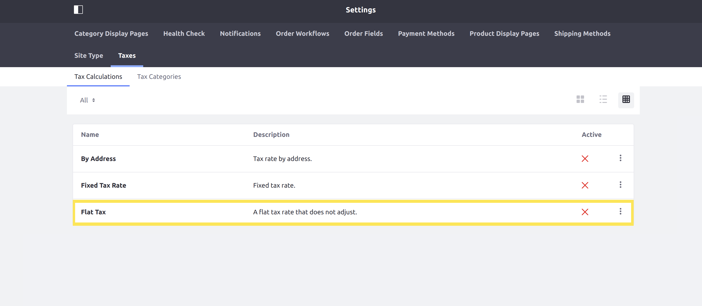

# Implementing a New Tax Engine

This tutorial will show you how to add a new tax engine by implementing the [CommerceTaxEngine](https://github.com/liferay/com-liferay-commerce/blob/2.0.5/commerce-api/src/main/java/com/liferay/commerce/tax/CommerceTaxEngine.java) interface.

A tax engine performs the calculation for taxes when a transaction is made. Liferay Commerce provides two default tax engines: [FixedCommerceTaxEngine](https://github.com/liferay/com-liferay-commerce/blob/2.0.5/commerce-tax-engine-fixed-service/src/main/java/com/liferay/commerce/tax/engine/fixed/internal/engine/FixedCommerceTaxEngine.java) for fixed rates, and [ByAddressCommerceTaxEngine](https://github.com/liferay/com-liferay-commerce/blob/2.0.5/commerce-tax-engine-fixed-service/src/main/java/com/liferay/commerce/tax/engine/fixed/internal/engine/ByAddressCommerceTaxEngine.java) for calculating taxes by address.


## Overview

1. [**Deploy an Example**](#deploy-an-example)
1. [**Walk Through the Example**](#walk-through-the-example)
1. [**Additional Information**](#additional-information)

## Deploy an Example

In this section, we will get an example tax engine up and running on your instance of Liferay Commerce. Follow these steps:

1. Start Liferay Commerce.

    ```bash
    docker run -it -p 8080:8080 liferay/commerce:2.0.5
    ```

1. Download and unzip [Acme Commerce Tax Engine]().

    ```bash
    curl liferay-q4b9.zip
    ```

    ```bash
    unzip liferay-q4b9.zip
    ```

1. Go to `liferay-q4b9`.

    ```bash
    cd liferay-q4b9
    ```

1. Build and deploy the example.

    ```bash
    ./gradlew deploy -Ddeploy.docker.container.id=$(docker ps -lq)
    ```

    >**Note:** This command is the same as copying the deployed jars to /opt/liferay/osgi/modules on the Docker container.

1. Confirm the deployment in the Docker container console.

    ```bash
    STARTED com.acme.q4b9.impl_1.0.0
    ```

1. Verify that the example tax engine was added. Open your browser to `https://localhost:8080` and navigate to _Site Administration_ → _Commerce_ → _Settings_ → _Taxes_ → _Tax Calculations_. The new tax engine ("Flat Tax") will be present in the list shown.



Congratulations, you've successfully built and deployed a new tax engine that implements `CommerceTaxEngine`.

Next, let's dive deeper to learn more.

## Walk Through the Example

In this section, we will review the example we deployed. First, we will annotate the class for OSGi registration. Second, we will review the `CommerceTaxEngine` interface. And third, we will complete our implementation of `CommerceTaxEngine`.

### Annotate the Class for OSGi Registration

```java
@Component(
    immediate = true,
    property = "commerce.tax.engine.key=" + Q4B9CommerceTaxEngine.KEY,
    service = CommerceTaxEngine.class
)
public class Q4B9CommerceTaxEngine implements CommerceTaxEngine {

    public static final String KEY = "Example";
```

> It is important to provide a distinct key for the tax engine so that Liferay Commerce can distinguish the new engine from others in the [tax engine registry](https://github.com/liferay/com-liferay-commerce/blob/2.0.5/commerce-service/src/main/java/com/liferay/commerce/internal/util/CommerceTaxEngineRegistryImpl.java). Reusing a key that is already in use will override the existing associated tax engine.

### Review the `CommerceTaxEngine` Interface

Implement the following methods:

```java
public CommerceTaxValue getCommerceTaxValue(
        CommerceTaxCalculateRequest commerceTaxCalculateRequest)
    throws CommerceTaxEngineException;
```

> This method will be where the business logic is implemented for our tax engine. See [CommerceTaxValue](https://github.com/liferay/com-liferay-commerce/blob/2.0.5/commerce-api/src/main/java/com/liferay/commerce/tax/CommerceTaxValue.java) for more information.

```java
public String getDescription(Locale locale);
```

> This returns a brief description of our tax engine. See the implementation in [Q4B9CommerceTaxEngine.java](./implementing-a-new-tax-engine/liferay-q4b9.zip/q4b9-impl/src/main/java/com/acme/q4b9/internal/commerce/tax/Q4B9CommerceTaxEngine.java) for a reference in retrieving the description with a language key.

```java
public String getName(Locale locale);
```

> This returns the name of our tax engine. It works similarly to the `getDescription` method.

### Complete the Tax Engine

The tax engine is comprised of logic to perform the tax calculation. Do the following:

* [Add business logic to `getCommerceTaxValue`.](#add-business-logic-to-getcommercetaxvalue)
* [Add the language keys to `Language.properties`.](#add-the-language-keys-to-languageproperties)

#### Add Business Logic to `getCommerceTaxValue`

```java
@Override
public CommerceTaxValue getCommerceTaxValue(
        CommerceTaxCalculateRequest commerceTaxCalculateRequest)
    throws CommerceTaxEngineException {

    BigDecimal flatTaxValue = new BigDecimal("1.50");

    if (commerceTaxCalculateRequest.isPercentage()) {
        flatTaxValue = flatTaxValue.divide(new BigDecimal(100.0));

        flatTaxValue = flatTaxValue.multiply(
            commerceTaxCalculateRequest.getPrice());
    }

    return new CommerceTaxValue("flat-tax", KEY, flatTaxValue);
}
```

> The `CommerceTaxCalculateRequest` parameter contains information needed for making our calculation. For this example, we use the price from the `CommerceTaxCalculateRequest`, as well as a value indicating whether to apply the rate as a percentage. See [CommerceTaxCalculateRequest.java](https://github.com/liferay/com-liferay-commerce/blob/2.0.5/commerce-api/src/main/java/com/liferay/commerce/tax/CommerceTaxCalculateRequest.java) to find more methods you can use with a `CommerceTaxCalculateRequest`.

#### Add the Language Keys to `Language.properties`

Add the language keys and their values to a [Language.properties](./implementing-a-new-tax-engine/liferay-q4b9.zip/q4b9-impl/src/main/resources/content/Language.properties) file within our module:

```
a-flat-tax-rate-that-does-not-adjust=A flat tax rate that does not adjust.
flat-tax=Flat Tax
```

> See [Localizing Your Application](https://help.liferay.com/hc/en-us/articles/360018168251-Localizing-Your-Application) for more information.

## Conclusion

Congratulations! You now know the basics for implementing the `CommerceTaxEngine` interface, and have added a new tax engine to Liferay Commerce.

## Additional Information

* [Localizing Your Application](https://help.liferay.com/hc/en-us/articles/360018168251-Localizing-Your-Application)
* [Setting Tax Rate by Fixed Rate](../../user-guide/operations/setting-tax-rate-by-fixed-rate.md)
