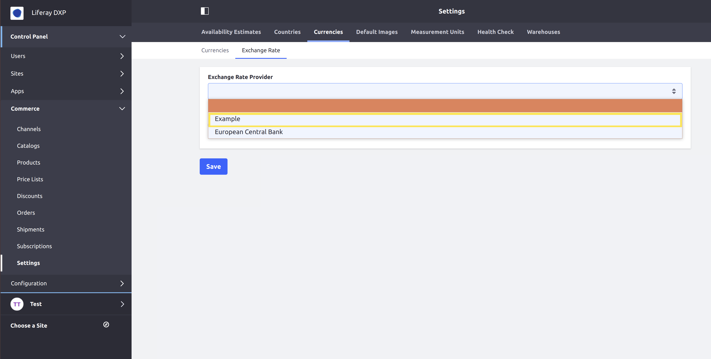

# Implementing an Custom Exchange Rate Provider

This tutorial will show you how to add a custom exchange rate provider by implementing the [ExchangeRateProvider](https://github.com/liferay/com-liferay-commerce/blob/2.0.5/commerce-currency-api/src/main/java/com/liferay/commerce/currency/util/ExchangeRateProvider.java) interface.

An exchange rate provider uses a data source to perform the exchange calculation between currencies. Liferay Commerce provides one exchange rate provider out-of-the-box, [ECBExchangeRateProvider](https://github.com/liferay/com-liferay-commerce/blob/2.0.5/commerce-currency-service/src/main/java/com/liferay/commerce/currency/internal/util/ECBExchangeRateProvider.java).


## Overview

1. [**Deploy an Example**](#deploy-an-example)
1. [**Walk Through the Example**](#walk-through-the-example)
1. [**Additional Information**](#additional-information)

## Deploy an Example

In this section, we will get an example exchange rate provider up and running on your instance of Liferay Commerce. Follow these steps:

1. Start Liferay Commerce.

    ```bash
    docker run -it -p 8080:8080 liferay/commerce:2.0.5
    ```

1. Download and unzip [Acme Commerce Exchange Rate Provider]().

    ```bash
    curl liferay-f2y1.zip
    ```

    ```bash
    unzip liferay-f2y1.zip
    ```

1. Go to `liferay-f2y1`.

    ```bash
    cd liferay-f2y1
    ```

1. Build and deploy the example.

    ```bash
    ./gradlew deploy -Ddeploy.docker.container.id=$(docker ps -lq)
    ```

    >**Note:** This command is the same as copying the deployed jars to /opt/liferay/osgi/modules on the Docker container.

1. Confirm the deployment in the Docker container console.

    ```bash
    STARTED com.acme.f2y1.impl_1.0.0
    ```

1. Verify that the example exchange rate provider was added. Open your browser to `https://localhost:8080` and navigate to _Control Panel_ → _Commerce_ → _Settings_ → _Currencies_ → _Exchange Rate_. The new exchange rate provider ("Example") will be present under the _Exchange Rate Provider_ dropdown.



Congratulations, you've successfully built and deployed a new exchange rate provider that implements `ExchangeRateProvider`.

Next, let's dive deeper to learn more.

## Walk Through the Example

In this section, we will review the example we deployed. First, we will annotate the class for OSGi registration. Second, we will review the `ExchangeRateProvider` interface. And third, we will complete our implementation of `ExchangeRateProvider`.

### Annotate the Class for OSGi Registration

```java
@Component(
    immediate = true,
    property = "commerce.exchange.provider.key=" + F2Y1ExchangeRateProvider.KEY,
    service = ExchangeRateProvider.class
)
public class F2Y1ExchangeRateProvider implements ExchangeRateProvider {

    public static final String KEY = "Example";
```

> It is important to provide a distinct key for the exchange rate provider so that Liferay Commerce can distinguish the new exchange rate provider from others in the [exchange rate provider registry](https://github.com/liferay/com-liferay-commerce/blob/2.0.5/commerce-currency-service/src/main/java/com/liferay/commerce/currency/internal/util/ExchangeRateProviderRegistryImpl.java). Reusing a key that is already in use will override the existing associated exchange rate provider.

### Review the `ExchangeRateProvider` Interface

Implement the following method:

```java
@Override
public BigDecimal getExchangeRate(
        CommerceCurrency primaryCommerceCurrency,
        CommerceCurrency secondaryCommerceCurrency)
    throws Exception;
```

> This method is called to calculate the exchange rate between currencies. The chosen data source for the rates must be able to handle any of the currencies that may be used in your instance of Liferay Commerce.

### Complete the Exchange Rate Provider

The exchange rate provider is comprised of logic to calculate the exchange rates between two currencies. Do the following:

* [Implement the exchange rate calculation logic.](#implement-the-exchange-rate-calculation-logic)

#### Implement the Exchange Rate Calculation Logic

```java
@Override
public BigDecimal getExchangeRate(
        CommerceCurrency primaryCommerceCurrency,
        CommerceCurrency secondaryCommerceCurrency)
    throws Exception {

    String primaryCurrencyCode = primaryCommerceCurrency.getCode();
    String secondaryCurrencyCode = secondaryCommerceCurrency.getCode();

    primaryCurrencyCode = StringUtil.toUpperCase(primaryCurrencyCode);
    secondaryCurrencyCode = StringUtil.toUpperCase(secondaryCurrencyCode);

    JSONArray exchangeRatesArray = _getStaticExchangeRates();

    List<String> codesList = JSONUtil.toStringList(
        exchangeRatesArray, "code");

    double primaryRate = _getRateForCode(
        exchangeRatesArray, codesList, primaryCurrencyCode);
    double secondaryRate = _getRateForCode(
        exchangeRatesArray, codesList, secondaryCurrencyCode);

    return new BigDecimal(secondaryRate / primaryRate);
}
```

> This example uses a data file with a static list of exchange rates as the data source, [f2y1-exchange-rates.json](./implementing-an-exchange-rate-provider/liferay-f2y1.zip/f2y1-impl/src/main/resources/com/acme/f2y1/internal/commerce/exchange/rates/f2y1-exchange-rates.json). See [ECBExchangeRateProvider](https://github.com/liferay/com-liferay-commerce/blob/2.0.5/commerce-currency-service/src/main/java/com/liferay/commerce/currency/internal/util/ECBExchangeRateProvider.java) for a more practical use case. See `_getStaticExchangeRates` and `_getRateForCode` by visiting [F2Y1ExchangeRateProvider.java](./implementing-an-exchange-rate-provider/liferay-f2y1.zip/f2y1-impl/src/main/java/com/acme/f2y1/internal/commerce/currency/util/F2Y1ExchangeRateProvider.java).
>
> Use the `CommerceCurrency` object for the two currencies to get the information needed, like their currency codes. See [CommerceCurrency.java](https://github.com/liferay/com-liferay-commerce/blob/2.0.5/commerce-currency-api/src/main/java/com/liferay/commerce/currency/model/CommerceCurrency.java) and [CommerceCurrencyModel.java](https://github.com/liferay/com-liferay-commerce/blob/2.0.5/commerce-currency-api/src/main/java/com/liferay/commerce/currency/model/CommerceCurrencyModel.java) to find more methods you can use with a `CommerceCurrency` object.

## Conclusion

Congratulations! You now know the basics for implementing the `ExchangeRateProvider` interface, and have added a new exchange rate provider to Liferay Commerce.

## Additional Information

* [Currencies](../../user-guide/getting-started/currencies.md)
* [Managing Exchange Rates](../../user-guide/getting-started/managing-exchange-rates.md)
